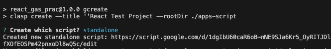
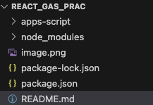
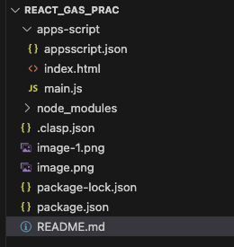

1) Start project:  
> npm init -y
2) Install clasp - make sure you have -D: 
> npm install -D @google/clasp
3) Enable google apps script API: https://script.google.com/home/usersettings
4) Set up clasp commands
5) use npm run for clasp commands
6) Run npm run gcreate to create new project 
7) Select project type: 



8) Install auto complete for script functions:
Make sure you have it set to devDependency 
> npm i -D @types/google-apps-script
9) File structure so far: 



10) Add doGet function to js file in apps-script directory
11) Add html file to apps-script directory
12) Add meta tags
13) File structure should look like this (You will need to move clasp.json file to root directory): 



14) Deploy as web app and do gpull to update appscript.json in local ide
15) Install parcel package

> npm install --save-dev parcel

16) Add src file at root level of project and add index.html file with a div with id of "app"
17) Add an index.js file with following code from parcel: 

```
import { createRoot } from "react-dom/client";
import { App } from "./App";

const container = document.getElementById("app");
const root = createRoot(container)
root.render(<App />);
```
18) Add App.js file with following code: 

```
export function App() {
     return <h1>Hello world!</h1>;
 }

 export default App;
```